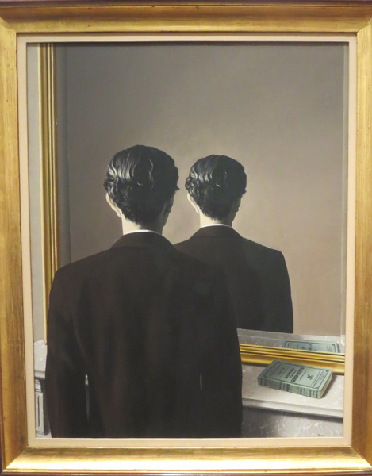

# Understanding the Four Rules of Simple Design

---

background-image: url(image/lightning.jpg)

???

## Tale

* Lightning crackles through the sky, illuminating your grim face.
* You stayed up late, but that is fine. You couldn't sleep anyway.
* Nervously you eye your phone, checking for the humpth time if it is on.
* Your rest your weary head.
* "I am just going to close my eyes for a little while", you tell your self.
* **Ring**
* You are startled by the noise that you have been dreading all night.
* **Ring**
* You answer your phone: "The integration module is acting up"
* The words you wish you had misheard echo in your brain.
* You open your laptop, far from ready, to battle the monsters of your nightmare.

---

background-image: url(image/dejavu.jpg)

???

## Who recognizes this

* Code nobody wants to touch in fear of breaking it.
* Development speed all but stopped.
* Adding features becomes ever more complex.
* You have two bugs, you fix one, now there are five.

---

background-image: url(image/why.png)

???

## Why does this happen?

* You are all smart.
* You all want to avoid this situation.
* You have the best intentions.

---

background-image: url(image/yellow_brick_road.jpg)

???

* The road to hell is paved with good intentions.
* And I am not the wizard of Oz that knows it all.
* I am here to tell you to look behind the curtain.

---

background-image: url(image/epke-zonderland.jpg)

???

## Who is this?

* Epke Zonderland (Rio 2016)
* Excellence from practice 
* Practice is not work

---

background-image: url(image/how.jpg)

???

## But how?

* How to practice?
* What to practice?
* When to practice?

---

[Kata](https://en.wikipedia.org/wiki/Kata) (型 or 形 literally: "form") are

> detailed choreographed patterns of movements practiced either solo or in
> pairs. The term form is used for the corresponding concept in non-Japanese
> martial arts in general.

???

## Kata help

* Repetition help
* No pressure for working software

---

## Four Rules of Simple Design

1. Tests Pass
2. Expresses Intent
3. No duplication
4. Small

???

## How to apply?

* Observed by Kent Beck
* Corey Haines wrote **understanding the 4 rules of simple design**

---

<iframe width="560" height="315" src="https://www.youtube.com/embed/--amYQPhCSE?rel=0" frameborder="0" allow="autoplay; encrypted-media" allowfullscreen></iframe>

???

## Demo

---

???

# Reflection

* This is an exposition
* Don't take it as truth
* Adopt it to your own

---

background-image: url(image/mountain_path.svg)

???

## Global Day of Code Retreat

* We answered why, we answered how, now answer when and where.
* If you are interested?
* Global day of code retreat
* **November 17, 2018**
* Maybe Honeypot wants to organize

---

???

## Audience participation

* I need two volunteers
* At least one should be familiar with Ruby

---

* **presentation**: [http://fifth-postulate.nl/4_rules_simple_design/](http://fifth-postulate.nl/4_rules_simple_design/)
* **twitter**: [@daan_van_berkel](https://twitter.com/daan_van_berkel)
* **GitHub**: [dvberkel](https://github.com/dvberkel)
